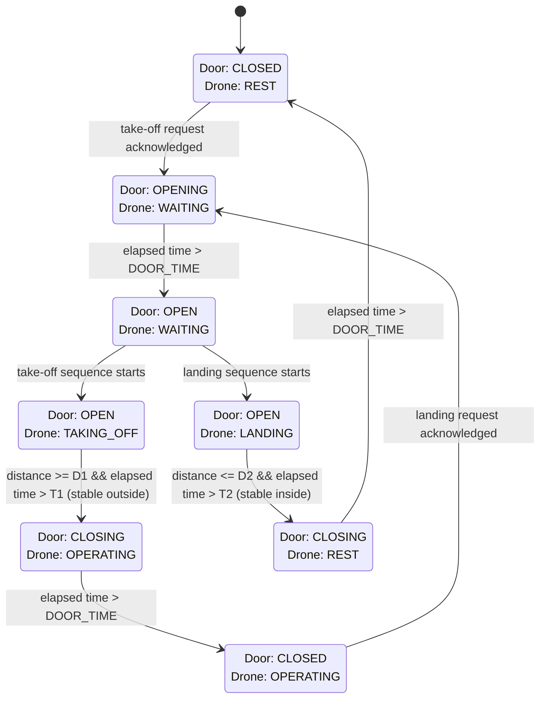

# Assignment #02 - Smart Drone Hangar

**Studenti:**

- Sergio Dobrianskiy (matr. 0001019553)  
- Vera Murgia      (matr. 0001114041)

[Repository Github]([2](https://github.com/Veenya/Assignment-02-Drone-Hangar/))

Ciascuno studente ha un branch proprio con il proprio file config.h.

## Abstract 
La FSM del progetto è composta da **8 stati**, ottenuti combinando lo **stato delle porte dell’hangar** (Closed, Opening, Open, Closing) con lo **stato del drone** (Rest, Waiting, Taking-off, Landing, Operating).

Rispetto alle specifiche, per la gestione delle porte sono stati introdotti due stati intermedi, **Opening** e **Closing**, necessari per modellare correttamente il comportamento fisico dell’attuatore: in questo modo il sistema attende che trascorra **DOOR_TIME** prima di considerare la porta completamente aperta o chiusa, evitando di avviare decollo/atterraggio mentre le porte sono ancora in movimento.

All’accensione il sistema esegue un breve **check di funzionamento delle porte**, effettuando un ciclo di apertura/chiusura; terminata questa fase, lo stato di default diventa **porta chiusa e drone a riposo** (`CLOSED_REST`).

Il comportamento operativo segue due flussi principali:

* **Take-off**: dalla condizione di riposo con porte chiuse, una richiesta valida porta allo stato **Opening**, poi a **Open/Waiting**; il decollo parte solo con porta aperta e termina quando il drone risulta stabilmente all’esterno (soglia **D1** mantenuta per almeno **T1**), dopodiché le porte passano a **Closing** e infine a **Closed/Operating**.
* **Landing**: dalla condizione “drone operativo” con porte chiuse, la richiesta di rientro avvia **Opening**, poi **Open/Waiting** e quindi **Landing**; l’atterraggio si conclude quando il drone risulta stabilmente all’interno (soglia **D2** mantenuta per almeno **T2**), quindi le porte si richiudono passando a **Closed/Rest**.

Infine, per facilitare il collaudo tramite l’interfaccia Java, è stato aggiunto un pulsante che **attiva/disattiva manualmente lo stato di allarme dell’hangar**. Questo consente di testare rapidamente i comportamenti legati all’allarme senza dipendere esclusivamente dal sensore di temperatura, che in condizioni reali sarebbe l’unico responsabile dell’attivazione e del reset dell’allarme.

## Grafico

## TODO
Per far far funzionare il progetto servono, se si usa VS Code, servono:
- PlatformIO
- Pacchetto Java
- nel file `Arduino\Assignment-02-Drone-Hangar\java\src\iot\drone_carrier\DashboardLauncher.java` 
  cambiare `String portName = "COM5";` inserendo la porta che viene utilizzata dal proprio pc
- nel file `Assignment-02-Drone-Hangar\arduino\src\config.h` settare i PIN utilizzati per il proprio Arduino